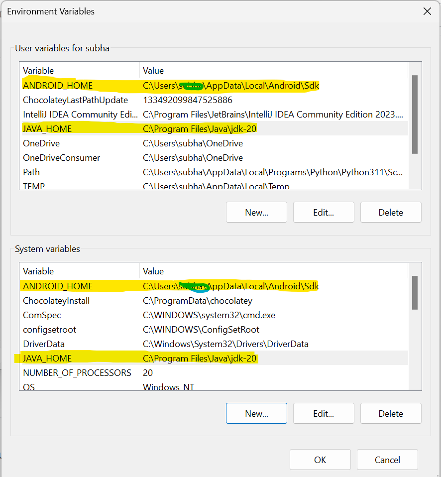
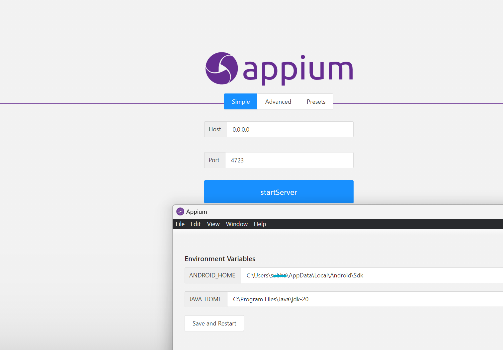
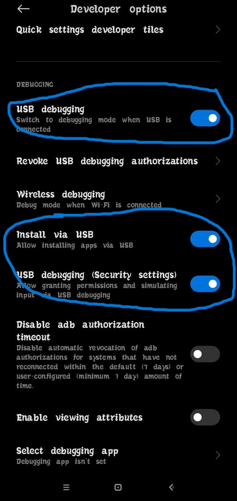
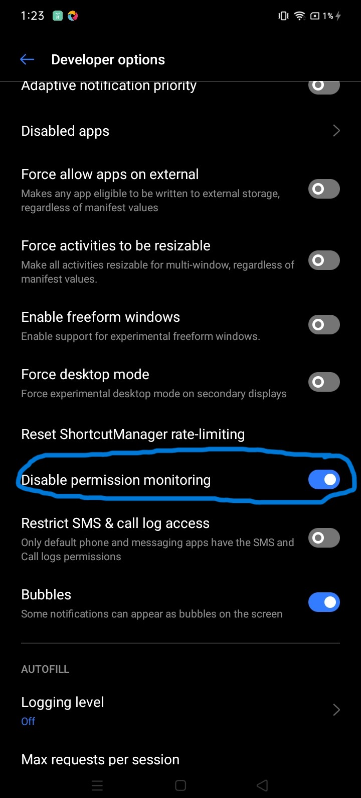

# Appium

## Requirements
- Download [appium-inspector](https://github.com/appium/appium-inspector/releases)<br>
- Download [nodejs](https://nodejs.org/en/download/current)


### Downlaod appium desktop client 
> Downlaod appium client desktop software from [here](https://github.com/appium/appium-desktop/releases)

--------------------------

### Install Appium from cmd
> `npm install -g appium`<br>
> `appium --version` to check installed successfully or not
>> install appium driver according to your requirements, see list of driver from [here](https://appium.io/docs/en/2.0/ecosystem/). command to install appium driver :- `appium driver install drivername`<br>
>> example :- `appium driver install uiautomator2` uiatomator2 is for android platforms.

> appium-doctor `npm install appium-doctor -g` to check all configuration 

### To uninstall Appium
> `npm uninstall appium`

--------------------------

### JAVA
- [Download java](https://www.java.com/download/ie_manual.jsp)
- install java and add bin path to environment variables

--------------------------

### Android studio and sdkmanager
- [Download android studio](https://developer.android.com/studio)
- install android studio and add bin path to environment variables
- open android studio, go to seeting search `Android Sdk` . Navigate to SDK Tool and install Android SDK Command-line Tools
- run `sdkmanger` in cmd to check sdkmanager is installed or not.
- If `sdkmanager` give error download it manually and follow steps from [here](https://developer.android.com/tools)
- Add bin folder of `android studio and sdkmanager` in enviroment variables


<h4 style ="background-color:#948f87; color:black; border-radius:3px; padding:3px;"><span style="color:ReD">NOTE:</span> You need to turn on system developer mode. command to navigate devloper seeting :<span style="color:#0e20eb"> start ms-settings:developers </span></h4>

--------------------------

### Realtime Mobile Testing
- tool 👇
> Vysor <br>
> [Universal ADB Driver](https://adb.clockworkmod.com/)
<h4 style ="background-color:#948f87; color:black; border-radius:3px; padding:3px;"><span style="color:ReD">NOTE:</span> You need to enable usb debugging from devloper mode in your mobile.</h4>

--------------------------

### Android Version
check your android version and check api level from [here](https://apilevels.com/)
> run command with your api level `sdkmanager "platform-tools" "platforms;android-apilevel"`
- example for andoid 10 `sdkmanager "platform-tools" "platforms;android-33"`

If you got error than try with java8 [here](https://www.java.com/download/ie_manual.jsp)

--------------------------
### Install the SDK
> Within Android Studio, you can install the Android 13 SDK as follows:<br>
> - Click setting > Adndroid sdk.<br>
> - In the SDK Platforms tab, select Android UpsideDownCake Preview.
> - In the SDK Tools tab, select Android version or  API Level  > 33.
> - Click Apply to install the SDK.<br>
--------------------------

### Platform-Tools (adb)

platform-tool [link](https://android-sdk-platform-tools.en.uptodown.com/windows/download)
unzip the zip file and copy the path and add to enviroment variable
- check adb in cmd `adb devices`. It show the connected devices list that you connected through vysor.


--------------------------
## appium configuration
> add android sdk and java path in envorement variable as follows :- 
>> - open environment variables
>> - add androidsdk path in system variable :- click new give variable name  ANDDROID_HOME andd write sdk path
>> - click new and give variable name JAVA_HOME and write java path 
>> - open appium gui and click edit configuration and give path of android sdk and java<br>
>> </img>
>> </img>

--------------------------
### Turn On Appium server
> - in cmd type `appium` i will start the server in 0.0.0.0 with port number 4723
> - -------------  OR Using Desktop Appium Application ------------
>- open appium server Gui application and click on  start server

--------------------------
## Mobile devloper configuration
>> </img>
> - If USB debugging (Security settings) is not present on your device than turn on `Disable permission  monitoring `👇
>> </img>

--------------------------
## Test appium inspector
> - connect your device on create emulator
> - on cmd `appium`
> - open  appium inspector and set following values :- 
>>{
  "platformName": "Android",
  "appiun:platformVersion": "13",
  "appium:deviceName": "729c0cba8ed3",
  "appium:automationName": "UiAutomator2",
  "appium:ensureWebviewsHavePages": "true"
}
> start session
<h4 style ="background-color:#948f87; color:black; border-radius:3px; padding:3px;"><span style="color:ReD">NOTE:</span> Your Appium server is runner and check port number. `appium` to start appium server</h4>
--------------------------
# Testing
> - need ide(vscode or pycharm)<br>
> - install modules -> `pip install -r requirements.txt`

### Code - Main.py
```
import unittest
from typing import Dict,Any
from appium import webdriver
from appium.options.android import UiAutomator2Options
from appium.webdriver.common.appiumby import AppiumBy

capabilities:Dict[str,Any] = dict(
    platformName='Android',
    automationName='uiautomator2',
    deviceName='Android',
    appPackage='com.android.settings',
    appActivity='.Settings',
    language='en',
    locale='US'
)

appium_server_url = 'http://localhost:4723'

class TestAppium(unittest.TestCase):
    def setUp(self) -> None:
        self.driver = webdriver.Remote(appium_server_url, options=UiAutomator2Options().load_capabilities(capabilities))

    def tearDown(self) -> None:
        if self.driver:
            self.driver.quit()

    def test_find_battery(self) -> None:
        el = self.driver.find_element(by=AppiumBy.XPATH, value='//*[@text="Battery"]')
        el.click()

if __name__ == '__main__':
    unittest.main()
```
